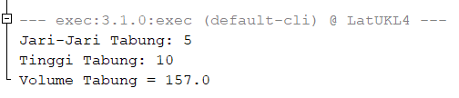

# LatihanUKLSedang2
## Program untuk menghitung volume tabung menggunakan jari-jari dan tinggi yang diinput oleh pengguna
Pengguna akan diminta untuk menginput nilai untuk jari-jari tabung, dan tinggi tabung.\
Program akan menghitung luas alas, mengalikan jari-jari yang diinput penguna dengan pi. Kemudian luas alas tersebut dikalikan dengan tinggi yang diinput pengguna.

